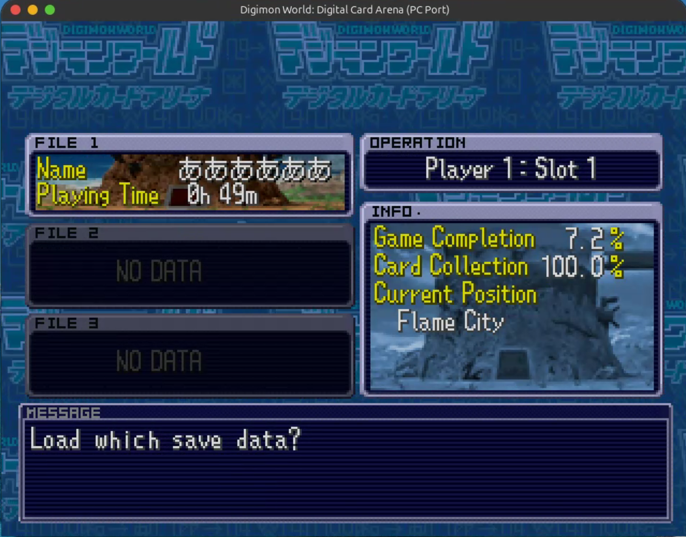
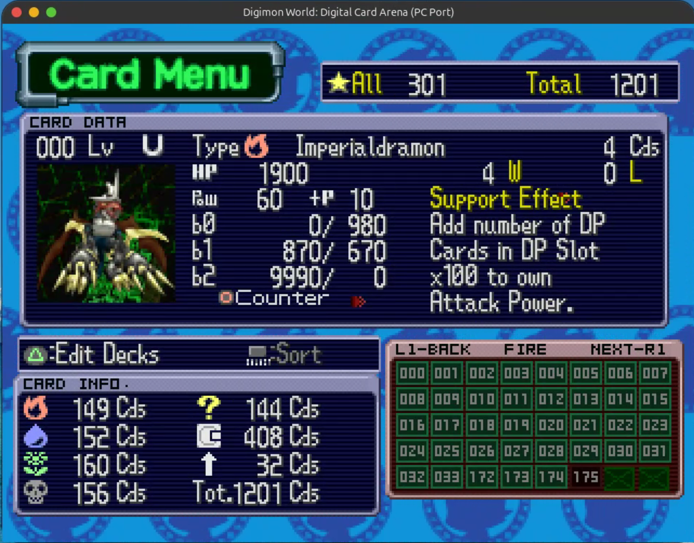
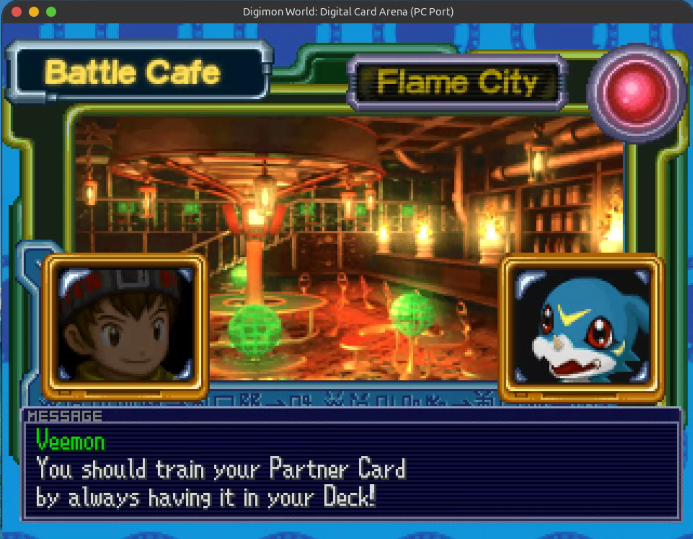
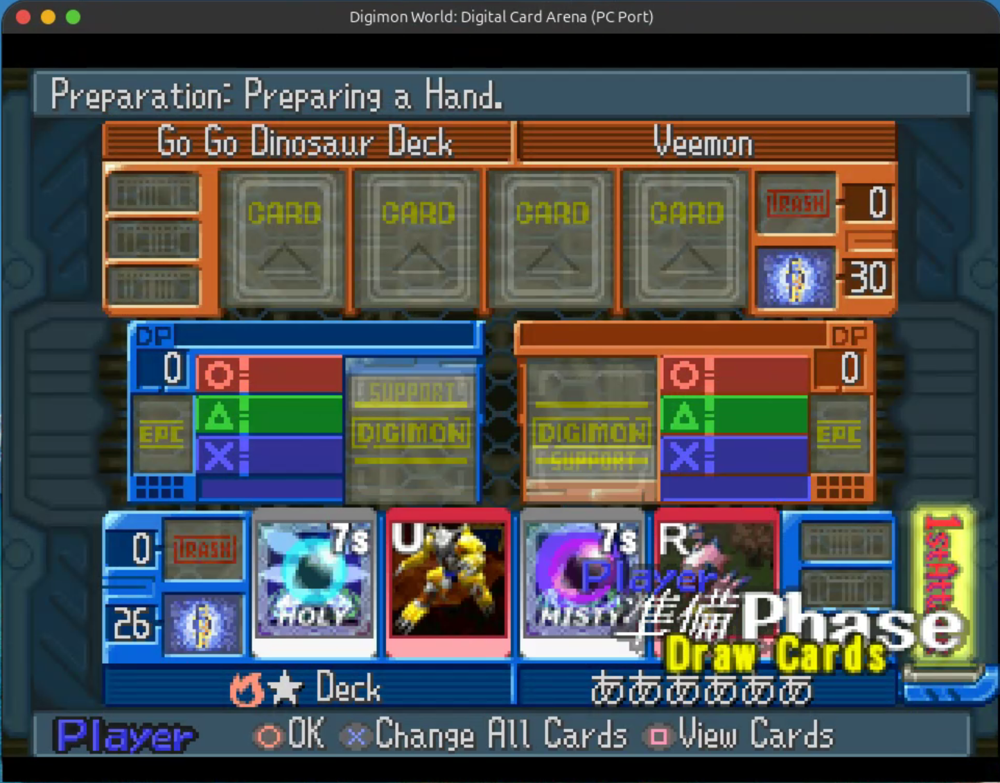
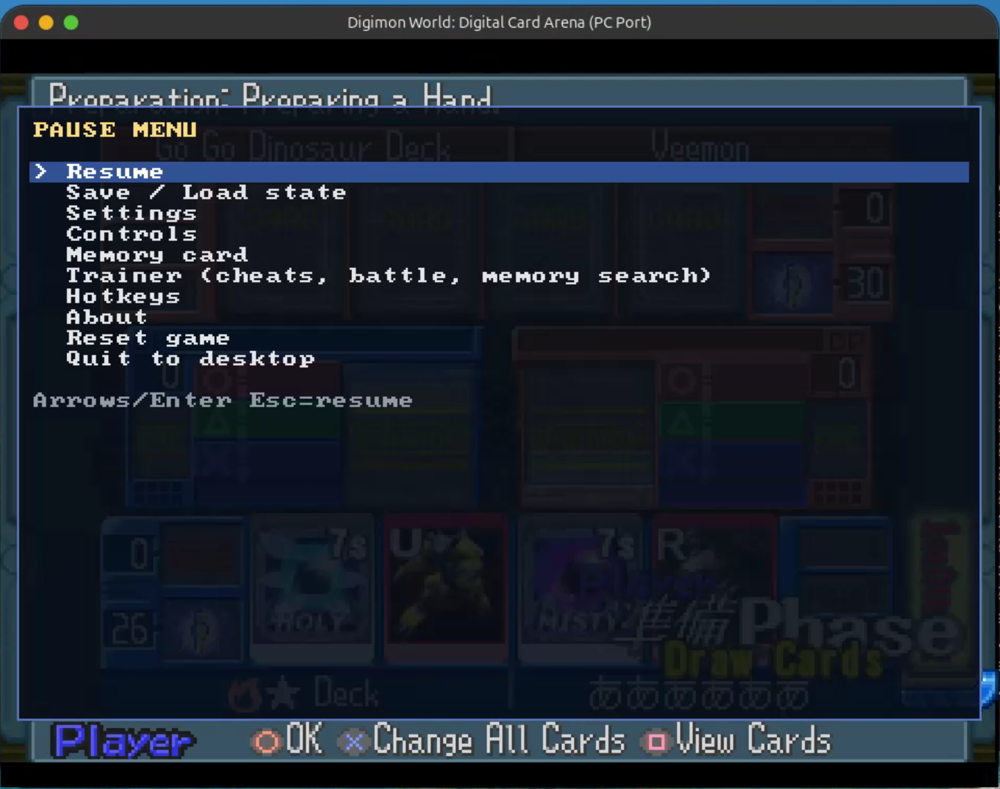
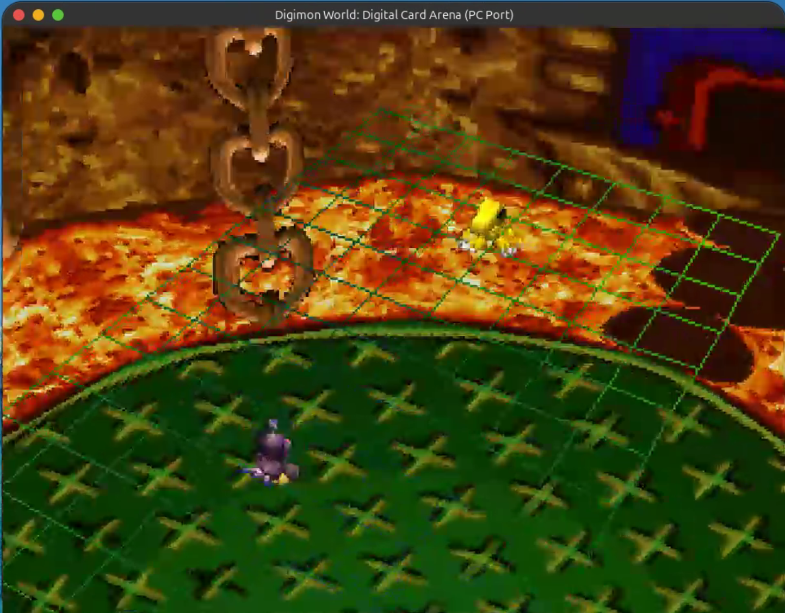

# dcb-static-recomp

Static recompilation of **Digimon World: Digital Card Arena** (PS1, SLPS-03101) into a native PC
executable: MIPS R3000A → C, with native HLE of the kernel and Psy-Q libraries. It needs
**no BIOS and no emulator** at runtime. The game is always the Japanese SLPS-03101; English text
and art can be grafted onto it from your own dump of the US disc (SLUS-01328).

> Copyrighted inputs (`disc/`, `bios/`, `extracted/`, `assets/`, `generated/`) are gitignored. Never commit them.

## Showcase

<table>
  <tr>
    <td align="center" width="33%"><br><sub>Title screen</sub></td>
    <td align="center" width="33%"><br><sub>Load screen in English</sub></td>
    <td align="center" width="33%"><br><sub>Card data</sub></td>
  </tr>
  <tr>
    <td align="center" width="33%"><br><sub>Battle Cafe</sub></td>
    <td align="center" width="33%"><br><sub>Battle UI</sub></td>
    <td align="center" width="33%"><br><sub>Native pause menu</sub></td>
  </tr>
  <tr>
    <td align="center" width="33%"><br><sub>Polygon battle</sub></td>
  </tr>
</table>

*Running natively on Linux (SDL3 on Wayland): recompiled game code, native GPU renderer, English
text and art built from the player's own discs.*

## Progress

**Core**
- [x] Disc extraction and Ghidra pipeline (`ghidra_psx_ldr`, Psy-Q signatures, Ghidra MCP)
- [x] MIPS → C recompiler with overlay support (boot EXE 99.4% covered, overlays 83–98%)
- [x] Native BIOS/kernel HLE: no BIOS image needed; game task system on native fibers
- [x] Host-driven main loop: pause (P), frame advance (N), fast-forward (hold Tab) ([design](docs/HOST_MAIN_LOOP.md))
- [x] GTE commands implemented (unit-tested; awaiting in-game use)
- [x] CI: Linux tests + Windows .exe (manual trigger for now)

**Game data**
- [x] CD-ROM streaming from the original disc image; runs from the disc image alone (no BIOS, no extracted files)
- [x] Runs from extracted game data alone (sectors rebuilt from files; verified identical to the disc)
- [x] One-time asset import from the player's own dump: no disc needed afterwards, no copyrighted data in the download (`dcb --setup`, or a first-run window asking for both discs, checked against redump.org)
- [x] Everything the game reads lives in `assets/` (game data at `assets/dump/<serial>/`), found next to the program whatever the working directory

**Game**
- [x] Boot FMV (MDEC, 24-bit), title screen (GPU renderer, SDL3 window)
- [x] Sound: SPU music and effects, XA-ADPCM movie audio
- [x] Input: keyboard and gamepad → PS1 digital pad (timed SIO0 model); any key skips movies
- [x] Main menu and navigation (title, main menu, Reception, Deck screens)
- [x] Card battles (KAWSEG overlay): a full battle played through
- [x] Memory card saves verified in game (`saves/<serial>/card1.mcd`, raw 128 KB `.mcd` image; `bu00:` file API)
- [ ] Remaining game modes and overlays (EVOSEG, SAISEG, SUBSEG, SUGSEG, ENDSEG)
- [ ] `PSX2.EXE` mode (`LoadExec`)

**English build** (SLPS-03101 code + English assets from the player's US dump, SLUS-01328; [research and plan](docs/HYBRID_EN_ASSETS.md))
- [x] English font, card/deck names and effect text, menus and dialogs (text catalog), city, tutorial and event scripts, VS-screen big names
- [x] US art (1114 images, 717 palettes) and the US opening movie
- [x] Built on the player's machine by the program itself (`src/patch`, C++): no Python or ffmpeg, identical to the offline pipeline (`tools/patch/compare_*.sh`)
- [x] Community fixes (Effect Text Fix, Digi-Parts Fix) applied when the player supplies them
- [x] English title in the public build (the US subtitle, copyright and menu labels fitted into the JP title; the JP logo stays)
- [ ] D-1 Grand Prix (a Japan-only mode: no US text to take)

**Distribution**
- [x] Public: the program alone; the first run builds everything from the player's two discs
- [x] Private: `pack.sh` zips a self-contained bundle (program + `assets/`) from your own dumps, for your own machines
- [x] Private single file: `pack.sh -1`, the bundle appended to the program, unpacked next to it on first start

**PC features**
- [x] PC options: `settings.ini` (initial window size, filtering, aspect, key/gamepad rebinding, volume); resizable window, picture fits it (F8: fit / integer)
- [x] Native pause menu: Esc / F1 (gamepad Start+Select) with save/load slots, settings, controls, memory-card backup/restore, about, quit with confirmation
- [x] Performance overlay (FPS, game FPS, CPU/GPU load, audio queue): F3
- [x] Save states within a run: F5 save, F7 load, F6 slot 1-4, bit-identical after a load (Linux, Windows MinGW build)
- [x] Input record / replay (`DCB_RECORD`, `DCB_REPLAY`): reproducible runs, bit-identical frames
- [x] Trainer (F4, or the F1 menu): built-in presets (all cards, all Digi parts), your own GameShark-style codes (`cheats/<serial>.txt`), battle actions on F10/F11/F12, memory search
- [x] Asset pipeline: rip textures/sound banks, pack them into one `.pak` the game loads (same-size edits today)
- [ ] Windows x64 release build tested on Windows
- [ ] Enhance / upscale assets (needs a renderer with higher internal resolution to show HD art)
- [ ] Enhancements: widescreen
- [ ] Network Battle
- [x] Mods: beaten Battle Arena bosses (Wormmon, Stingmon, Shadramon, Digimon Emperor, A) can be fought again in the Battle Cafe
- [ ] Custom Battle mode: pick the opponent and the arena
- [ ] Rust port of the game logic

## Quick start

You need your own dumps (raw `.cue`/`.bin`, Mode 2 / 2352-byte sectors) of the Japanese disc
**SLPS-03101** and the US disc **SLUS-01328** (English text and art). The first-run window asks for
both; only a start without a window (`DCB_HEADLESS=1`) runs in Japanese from the Japanese dump
alone. Building from
source recompiles the game code from your own disc, so the boot EXE is extracted first (Linux; the
compiler and SDL3 development packages are listed in [Building](docs/wiki/Building.md#requirements-linux)):

```bash
python3 tools/disc/extract_disc.py disc/SLPS-03101/dcb_jp.cue -o extracted/SLPS-03101
cmake --preset linux-debug && cmake --build --preset linux-debug --target recompile
cmake --build --preset linux-debug
./build/linux-debug/dcb                                # or ./dcb.sh (build + run)
```

A built `dcb` only needs the game data, set up once from dumps of the Japanese and North American
discs (`dcb --setup <jp.cue> <us.cue>`, or the first-run window): both are verified against
redump.org and imported, and the English data is built from them. A Windows x64 `.exe`
cross-compiles with `cmake --preset windows-cross && cmake --build --preset windows-cross`.
`./pack.sh` zips a ready-to-run bundle (program + `assets/`: the pak, the English files, the US
movie override when the pak has no native movies, and the game data) from your dumps, for your own
machines; see the wiki pages below.

## Documentation

The wiki lives in [docs/wiki/](docs/wiki/Home.md):

- [Building](docs/wiki/Building.md): layout, recompile workflow, presets, `dcb.sh`
- [Game Data](docs/wiki/Game-Data.md): `dcb --setup`, `dcb --import`, first run, data lookup, file overrides
- [Playing](docs/wiki/Playing.md): settings, hotkeys, pause menu, save states, memory cards,
  Wizardmon's passwords (US or Japanese) and the port's completion codes (CARDnnn, DIGIPARTnnn)
- [Trainer](docs/wiki/Trainer.md): presets, battle actions, cheat file format, memory search
- [Mods](docs/wiki/Mods.md): gameplay mods (boss rematches, arena saves, Player Rooms, post-game), turned on or off in `settings.ini`
- [English Text](docs/wiki/English-Text.md): English font, card/deck text and text catalog from the US dump
- [Community Fixes](docs/wiki/Community-Fixes.md): romhacking.net fixes applied to SLPS-03101
- [Textures](docs/wiki/Textures.md): asset ripper, replacement textures, US images, sprite resizing
- [Movies](docs/wiki/Movies.md): native MPEG-1 movies
- [Debugging and RE](docs/wiki/Debugging-and-RE.md): tracing, record/replay, RAM watch, coverage, env var reference
- [Ghidra](docs/wiki/Ghidra.md): project import, Ghidra MCP, scripts

Design and research notes:
[HYBRID_EN_ASSETS.md](docs/HYBRID_EN_ASSETS.md) (English build plan),
[HOST_MAIN_LOOP.md](docs/HOST_MAIN_LOOP.md) (main loop, save states),
[RE_WORKFLOW.md](docs/RE_WORKFLOW.md) (reverse-engineering loop),
[docs/re/](docs/re/README.md) (subsystem notes:
[battle](docs/re/battle.md), [text engine](docs/re/text-engine.md), [save data](docs/re/save-data.md)).

## Discs

| Serial | Title | Boot EXE | Entry |
|---|---|---|---|
| SLPS-03101 | Digimon World: Digital Card Arena (JP) | SLPS_031.01 (+ PSX2.EXE) | 0x80058CFC |
| SLUS-01328 | Digimon Digital Card Battle (US) | SLUS_013.28 | 0x80056270 |

## Credits

- **Digi-Parts Fix** ([romhacking.net hack 8474](https://www.romhacking.net/hacks/8474/)) by
  **Gledson999**: the missable Digi-Part 037 table fix, applied here to the SLPS overlays.
- **Effect Text Fix** ([romhacking.net hack 9360](https://www.romhacking.net/hacks/9360/)) by
  **jota_verso**: corrected card effect text, used as the English for those cards.
