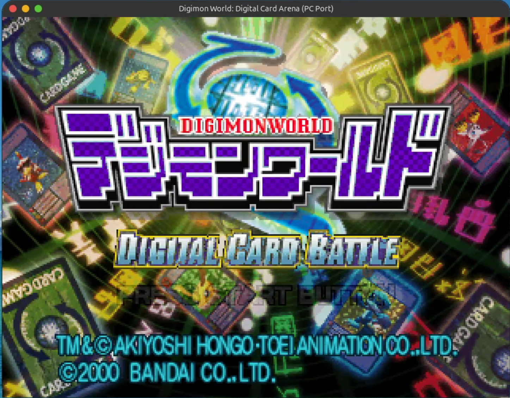

# dcb-static-recomp

Static recompilation of **Digimon World: Digital Card Arena** (PS1, SLPS-03101) into a native PC
executable: MIPS R3000A → C, with native HLE of the kernel and Psy-Q libraries. It needs
**no BIOS and no emulator** at runtime.

> Copyrighted inputs (`disc/`, `bios/`, `extracted/`, `assets/`, `generated/`) are gitignored. Never commit them.

## Showcase



*Title screen running natively on Linux (SDL3 on Wayland): recompiled game code, native GPU renderer.*

## Progress

- [x] Disc extraction and Ghidra pipeline (`ghidra_psx_ldr`, Psy-Q signatures, Ghidra MCP)
- [x] MIPS → C recompiler with overlay support (boot EXE 99.4% covered, overlays 83–98%)
- [x] Native BIOS/kernel HLE: no BIOS image needed
- [x] Game task system on native fibers
- [x] CD-ROM streaming from the original disc image
- [x] Render boot FMV (MDEC, 24-bit)
- [x] Title screen (GPU renderer, SDL3 window)
- [x] Sound: SPU music and effects, XA-ADPCM movie audio
- [x] Runs from the disc image alone (no BIOS, no extracted files)
- [x] Runs from extracted game data alone (sectors rebuilt from files; verified identical to the disc)
- [ ] Input map (keyboard and gamepad → PS1 pad)
- [ ] Main menu and navigation
- [ ] Card battles (KAWSEG overlay)
- [ ] Remaining game modes and overlays (EVOSEG, SAISEG, SUBSEG, SUGSEG, ENDSEG)
- [ ] Memory card saves verified in game
- [ ] `PSX2.EXE` mode (`LoadExec`)
- [ ] One-time asset import from the player's own dump: no disc needed afterwards, no copyrighted data in the download
- [ ] Windows x64 release build tested on Windows
- [ ] US version (SLUS-01328, Digimon Digital Card Battle)
- [x] PC options: `settings.ini` (window scale, filtering, aspect, key/gamepad rebinding, volume)
- [x] Performance overlay (FPS, game FPS, CPU/GPU load, audio queue): F3
- [x] GTE commands implemented (unit-tested; awaiting in-game use)
- [x] Memory card file API (`bu00:`) implemented (unit-tested; awaiting in-game use)
- [x] CI: Linux tests + Windows .exe on every PR
- [ ] Enhance / upscale assets
- [ ] Enhancements: widescreen, translation
- [ ] Network Battle
- [ ] Rust port of the game logic

## Layout

```
disc/<serial>/          disc images (.bin/.cue), one folder per serial       [ignored]
bios/                   retail BIOS dumps: reference and diff-testing only   [ignored]
extracted/<serial>/     extract_disc.py output: fs/, exe/boot.*, manifest    [ignored]
assets/raw|converted/   asset pipeline in/out                                [ignored]
generated/<serial>/     MIPS→C output of tools/recomp; never hand-edited     [ignored]
config/<serial>/        recompiler inputs: functions.json, overlays, overrides
ghidra/project/         Ghidra DB (DCB.gpr; one folder per serial)           [ignored]
ghidra/scripts/         Ghidra scripts (export_functions.py → config/)
ghidra/symbols/         exported, reviewable symbol maps
src/runtime/            CPU context, memory bus, dispatch, GTE (the C ABI of generated code)
src/hle/                kernel + Psy-Q replacements, MMIO fallback (see src/hle/README.md)
src/platform/           host seam: SDL3 window, input, audio (+ headless)
src/game/               entry point + hand-written overrides of recompiled functions
tools/disc/             extract_disc.py (+ tests)
tools/ghidra/           setup_ghidra_mcp.sh, import_ghidra.sh
tools/recomp/           the MIPS→C recompiler (C++ host tool)
tools/assets/           TIM / VAB / XA / STR converters
tests/                  runtime unit tests (ctest)
```

## Workflow

```bash
# 1. Disc → filesystem + boot EXE
python3 tools/disc/extract_disc.py disc/SLPS-03101/dcb_jp.cue -o extracted/SLPS-03101

# 2. Boot EXE → Ghidra (ghidra_psx_ldr loader + Psy-Q signatures), ~3 min
tools/ghidra/import_ghidra.sh SLPS-03101

# 3. Overlay table (P.DRV) → config/<serial>/overlays.json
python3 tools/disc/pdrv_segments.py SLPS-03101

# 4. Recompile MIPS → C into generated/SLPS-03101/ (+ discovered.json), then build.
#    Discovery: entry + Ghidra functions + every call (EXE and overlays) + data pointers + lui/addiu
#    constants, followed by control flow; jump tables are sized from their sltiu bounds check.
cmake --preset linux-debug && cmake --build --preset linux-debug --target recompile

# 5. Mirror the discovery into Ghidra (new functions + overlay blocks such as KAWSEG::801E2A6C):
#    GUI: Script Manager > DCB > ApplyDiscovered.java (or via MCP run_ghidra_script), or headless
#    with Ghidra closed:
../ghidra_12.1.2_PUBLIC/support/analyzeHeadless ghidra/project DCB/SLPS-03101 -process SLPS_031.01 \
    -noanalysis -scriptPath ghidra/scripts -postScript ApplyDiscovered.java "$PWD"

# 6. Build: native dev loop, or a Windows x64 .exe cross-compiled from Linux
cmake --preset linux-debug   && cmake --build --preset linux-debug && ctest --preset linux-debug
cmake --preset windows-cross && cmake --build --preset windows-cross
./build/linux-debug/dcb            # or ./dcb.sh
```

**Game data.** `dcb [extracted-dir | disc.cue | disc.bin]`. Without an argument it uses, in order:
`DCB_DISC`, `extracted/<serial>/` (native extracted data: `layout.txt` + `fs/` + `iso_meta.bin`,
written by step 1), then a `.cue`/`.bin` in `disc/<serial>/` or the current directory. Extracted data
rebuilds every CD sector on demand, so the disc image is not needed once it has been extracted.

Select the target with `-DDCB_GAME_ID=SLUS-01328` (default: `SLPS-03101`).

## Ghidra MCP

`.mcp.json` registers the `ghidra` server (bethington/ghidra-mcp 6.0.0, built for Ghidra 12.1.2).
Install or reinstall it with `tools/ghidra/setup_ghidra_mcp.sh`. Start Ghidra with
`tools/ghidra/ghidra_gui.sh`: it launches through PyGhidra (so `.py` scripts work in the GUI) and sets
`GHIDRA_MCP_ALLOW_SCRIPTS=1` (so MCP can run repo scripts; this allows arbitrary Java in Ghidra,
loopback only). Then in Ghidra:
enable **GhidraMCP** under *File → Configure → Configure All Plugins* (once), open the program, and choose
*Tools → GhidraMCP → Start MCP Server*.

## Discs

| Serial | Title | Boot EXE | Entry |
|---|---|---|---|
| SLPS-03101 | Digimon World: Digital Card Arena (JP) | SLPS_031.01 (+ PSX2.EXE) | 0x80058CFC |
| SLUS-01328 | Digimon Digital Card Battle (US) | SLUS_013.28 | 0x80056270 |
